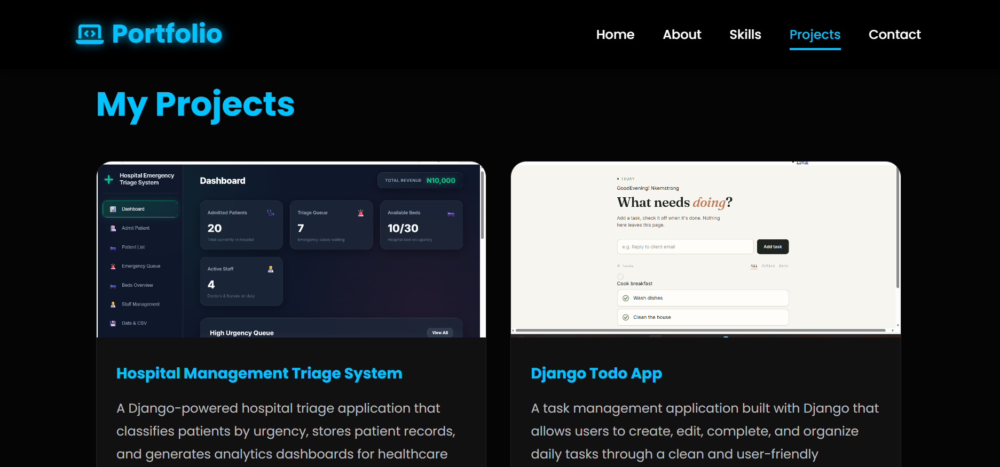
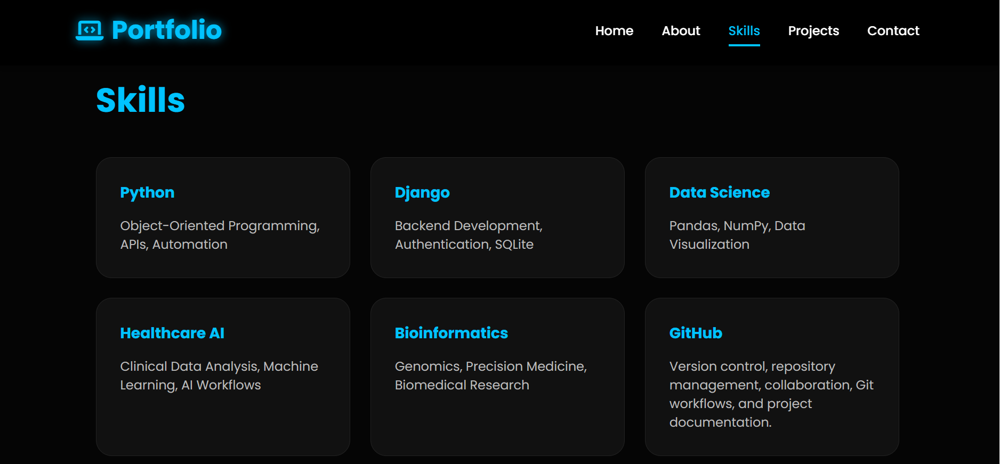
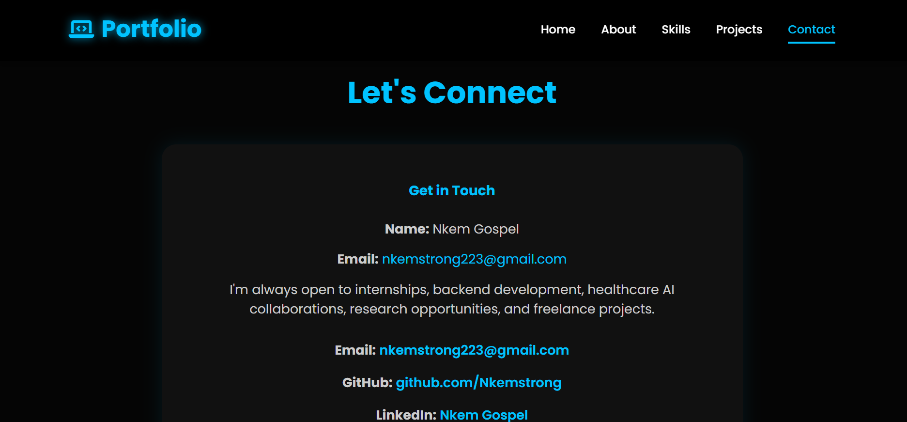

# 🌐 Nkem Gospel | Django Portfolio Website

A modern, dynamic portfolio website built with **Python** and **Django** to showcase my projects, technical skills, and experience as a Biomedical Scientist transitioning into Backend Development, Data Science, and Healthcare AI.

---

## 📸 Screenshots

### 🏠 Home Page
> Add a screenshot here


---

### 💻 Projects Page

> Add a screenshot here



---

### 🛠 Skills Page

> Add a screenshot here



---

### 📞 Contact Page

> Add a screenshot here



---

## 🚀 Features

- Dynamic Home Page
- About Page
- Skills Page powered by Django Models
- Dynamic Projects Showcase
- Contact Form with Django Forms
- Django Admin Dashboard
- Responsive Design
- Static & Media File Handling
- Project Image Uploads
- Professional Portfolio Layout

---

## 🛠 Built With

- Python 3
- Django 6
- HTML5
- CSS3
- SQLite3
- Django ORM
- Git
- GitHub

---

## 📂 Project Structure

```
portfolio-website/
│
├── config/
├── portfolio/
│   ├── templates/
│   ├── static/
│   ├── models.py
│   ├── views.py
│   ├── forms.py
│   └── admin.py
│
├── media/
├── manage.py
└── requirements.txt
```

---

## ⚙ Installation

Clone the repository

```bash
git clone https://github.com/Nkemstrong/django-portfolio.git
```

Move into the project

```bash
cd django-portfolio
```

Create a virtual environment

```bash
python -m venv myworld
```

Activate it

### Windows

```bash
myworld\Scripts\activate
```

### macOS/Linux

```bash
source myworld/bin/activate
```

Install dependencies

```bash
pip install -r requirements.txt
```

Run migrations

```bash
python manage.py migrate
```

Start the server

```bash
python manage.py runserver
```

Open your browser

```
http://127.0.0.1:8000/
```

---

## 📚 What I Learned

Building this project strengthened my understanding of:

- Django Models
- Views & URL Routing
- Django Templates
- Template Inheritance
- Static & Media Files
- Django Forms
- Admin Dashboard
- CRUD Operations
- Git & GitHub Workflow
- Debugging Django Applications

---

## 🔮 Future Improvements

- Deploy to Render
- Custom Domain
- Dark / Light Theme Toggle
- Blog Section
- Project Categories
- Downloadable Resume
- Email Notifications
- PostgreSQL Database

---

## 👨‍💻 About Me

I'm **Nkem Gospel**, a Biomedical Scientist and Python Backend Developer passionate about building software that bridges healthcare and technology.

My interests include:

- Python Backend Development
- Django
- Data Science
- Healthcare AI
- Bioinformatics
- Precision Medicine
- AI Automation

---

## 📬 Connect With Me

**LinkedIn**

https://www.linkedin.com/in/nkem-gospel-5b9206260

**GitHub**

https://github.com/Nkemstrong

**Email**

nkemstrong223@gmail.com

---

## ⭐ If you like this project

Please consider giving it a ⭐ on GitHub.

It motivates me to keep building and sharing more projects.
